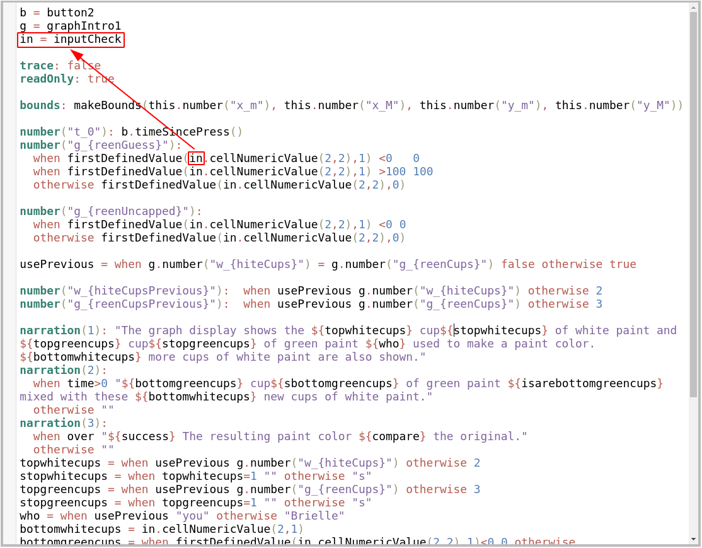

The [Harvey Mudd Clinic](https://www.hmc.edu/clinic/) program allows students in their senior year to work on a solutions to real-world, technical problems for industrial clients. My clinic project was with [Desmos](https://www.desmos.com/about), a free math education platform, working on their teacher-facing scripting language 'Computation Layer'.

## Activity Builder

My Clinic team is working primarily on the [Desmos Activity Builder](https://support.desmos.com/hc/en-us/articles/207656923-Activity-Builder-Overview), a platform that allows teachers and students to engage in interactive online math activities. These activities and their interaction are powered, under the hood, by a scripting language called Computation Layer.

##### Computation Layer

Computation Layer, according to the [Desmos Documentation](https://teacher.desmos.com/computation-layer/documentation#about), is "Computation Layer (CL) is the tissue that connects screens and components in our activities, converting discrete, isolated mathematical moments into a richer, more coherent experience for students. CL lets you connect different mathematical representations, to change what students see later based on their earlier work, and to collect data from an entire class of students."

## My Projects

Over the course of the Clinic, our team hopes to complete a number of projects to make Computation Layer easier to use for both teachers, who may be new to programming, and for the internal Desmos activity team. We hope to do this by implementing a series of new Language Features, IDE enhancements, and Overall Usability Features. One example of such a project, called Jump to Definition, is outlined below.

##### Jump to Definition

Our team worked on Jump to Definition in the fall, successfully creating a working prototype. This feature allows the user to quickly jump to the definition of a variable or component. Using the key combination of control + d and cursor location they are able to go to the definition location of the variable their cursor is on.

In order to complete this project, our implementation had to reach into the Abstract Syntax Tree of the parser to store and retrieve variable and component declarations and uses, as well as their positions in the editor window.

This project was personally challenging, as it required me to quickly learn and understand the Desmos codebase, as well as the implementation of the Pratt Parser behind Computation Layer. However learning, and then working within, a complicated production codebase such as this was a valuable experience.