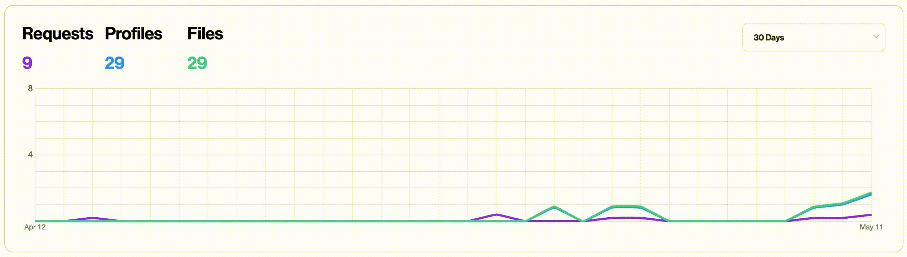
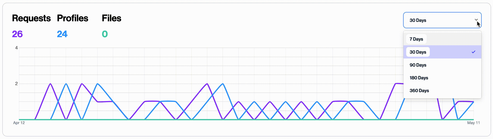

The goal of this project was to create a time series graph to display on a dashboard which could show the user changes in activity over time. It had to be both performant enough to be capable of quering and processing thousands of datapoints, and elegant enough for a seamless user experiance. This project was full stack, meaning that I was responsible for building all of the queries, back-end routes, and front-end components.

Using a combination of SQL queries and post-processing on the back-end, this time series analytics graph is able to show processing history for privacy requests over time. The endpoint is able to process thousands of datapoints efficiently, and group them into time 'buckets' to display on the front-end.

Using a drop down on the right, the user is able to select from a series of timescales - each of which group datapoints into appropriately sized buckets, keeping the front-end performant.

